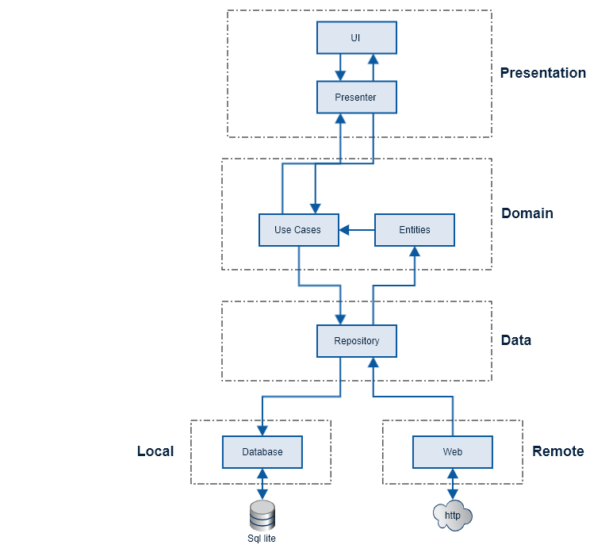

# RickAndMorty

## Architecture
App is built using clean architecture and mvvm design pattern.

Modules used are as described below
* **Presentation:** This module includes the UI, ViewModels and DI classes.
* **Domain:** This module contains all business models and use cases.
    * Entities will be used by presentation layer to render data and perform actions according to business rules.
    * Use cases are interactors and stand for application-specific business rules of the software. This layer is isolated from changes to the database, common frameworks, and the UI.
* **Data:** This module provides data from web/local to domain layer. It contains an abstract definition of the different data sources, and how they should be used. It is independent of database and http client implementations.
* **Local:** This module contains implementation for providing data from local. It uses room for getting data from local db.
* **Remote:** This module contains implementation for providing data from http client. It uses retrofit as a source to fetch data from the web.

Along with the Clean Architecture approach, the following Android architecture components are also used:
* **Room:** Provides an abstraction layer over SQLite to allow for more robust database access while harnessing the full power of SQLite.
* **ViewModel:** Designed to store and manage UI related data in a life cycle conscious way
* **Live Data:** An observable data holder class that, unlike a regular observable, is life cycle aware, meaning it respects the lifecycle of other app components such as activities, fragments, and services
* **Paging Library:** Makes it easier to load data gradually and gracefully within RecyclerView.

Also the following technologies are used:
* **Kotlin:** A statically typed programming language for modern multi-platform applications. Google rates Kotlin a first-class language for writing Android apps.
* **Hilt:** Used for dependency injection.
* **Retrofit 2:** A type-safe HTTP client for Android and Java  

## Things To Do
* Migrate to viewpager 2
* Add detail screens
* Add favourite functionality
* Code cleanup